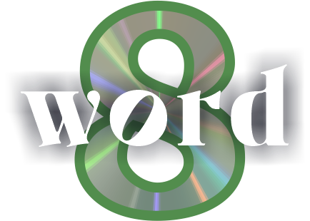

<h1 align="center">

 
Word Eight
<h5 align="center">📍 A word guessing game inspired by Wordle!</h3>

<h3 align="center">🚀 Developed with the software and tools below:</h3>

 

## 📍 Overview

Word Eight is an open source game written in TypeScript with Next.js. Players will have 8 tries to guess an 8 letter word, featuring a new word each day. It is heavily influenced by the New York Times word game, Wordle. The over-arching goal of this project is to demonstrate my programming abilities in the above technologies in hopes of finding a career in web development 👍

## 🚀 Deployment 

[WordEight.com](https://www.wordeight.com/)

## 🛠 Future Development

- [X] [📌  Add on screen keyboard]
- [X] [📌  Create branding]
- [ ] [📌  Create Leaderboards]

